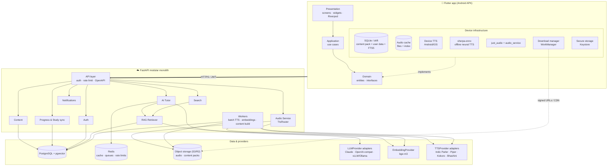

# Gita Companion — Phase 1: Architecture & Technology Proposal

> Status: **PROPOSAL, awaiting approval.** No application code has been written yet.
> Target: an Android APK first (iOS-ready codebase), offline-first and audio-first, with a grounded AI tutor.

Contents

1. [Mobile stack](#1-mobile-stack)
2. [Backend stack](#2-backend-stack)
3. [Database](#3-database)
4. [Vector database](#4-vector-database)
5. [LLM architecture](#5-llm-architecture)
6. [TTS architecture](#6-tts-architecture)
7. [Free/open TTS options: capability matrix](#7-freeopen-tts-options--capability-matrix)
8. [Sanskrit audio strategy](#8-sanskrit-audio-strategy)
9. [Telugu audio strategy](#9-telugu-audio-strategy)
10. [Long-form audio architecture](#10-long-form-audio-architecture)
11. [Offline architecture](#11-offline-architecture)
12. [RAG architecture](#12-rag-architecture)
13. [System architecture diagram](#13-system-architecture-diagram)
14. [Database ER diagram](#14-database-er-diagram)
15. [Mobile screen map](#15-mobile-screen-map)
16. [Folder / project structure](#16-folder--project-structure)
17. [Infrastructure requirements](#17-estimated-infrastructure-requirements)
18. [Development phases](#18-development-phases)
19. [Risks and limitations](#19-risks-and-limitations)
20. [Licensing and copyright](#20-licensing--copyright-considerations)
21. [Decisions needed from you](#21-decisions-needed-before-phase-2)

---

## 0. Guiding decisions (the "why" behind everything below)

| Principle | Consequence in the design |
|---|---|
| **Scripture is static; AI is dynamic.** | All 700 verses, translations, transliterations and *pre-generated, reviewed* explanations ship as a versioned **content pack** (SQLite). The LLM is only used for genuinely open questions. That makes most of the app free to run and fully offline. |
| **Provenance on every piece of text.** | Each text block has a `kind` (sanskrit / transliteration / word_meaning / literal_translation / translation / explanation / commentary / practical / ai_generated) and a `source` with author, edition, license and an `is_ai_generated` flag. The UI renders a source label under every block. AI text is never shown in the same visual style as scripture. |
| **Deterministic beats generative.** | Transliteration (IAST, Telugu script, Kannada etc.) is produced by a deterministic transliteration library from the Devanagari source, not by an LLM, so it cannot hallucinate. Verse numbers are validated against a fixed verse-count table. |
| **Every audio source becomes a file.** | Device TTS, on-device neural TTS, server TTS and human recordings all produce cached audio files, so a single player handles playlists, seek, resume, speed and offline. |
| **Pre-compute once, serve forever.** | Sanskrit recitation and explanation audio for all 700 verses is generated in a batch job (rented GPU for a few hours) and stored in object storage; runtime TTS is only for dynamic text such as AI answers, and that uses free device TTS by default. |
| **Interfaces at every external boundary.** | `LLMProvider`, `EmbeddingProvider`, `TTSProvider`, `VectorStore`, `ContentRepository`, `AuthProvider`: swap any vendor without touching features. |

> **An example of why provenance and validation matter:** the example metadata in the brief says
> `chapter 2, verse 47, chapterName "Karma Yoga"`. Chapter 2 is *Sāṅkhya Yoga*; *Karma Yoga* is
> Chapter 3 (2.47 is still the classic karma-yoga verse). The app will keep chapter names in a
> canonical table and never let free text override them.

---

## 1. Mobile stack

**Recommendation: Flutter (Dart 3), Android first, iOS from the same codebase later.**

| Concern | Choice | Why |
|---|---|---|
| UI framework | **Flutter 3.x** | One codebase for Android and iOS. It ships its own text renderer with HarfBuzz shaping, so Devanagari conjuncts and Telugu render consistently across Android versions. Release APKs are produced with a single `flutter build apk`. |
| State / DI | **Riverpod** | Testable, compile-safe dependency injection; providers map 1:1 to the clean-architecture interfaces. |
| Navigation | **go_router** | Deep links (e.g. `gita://verse/2/47`) for "Today's Verse" notifications and sharing. |
| Local DB | **drift** (SQLite, with **FTS5**) | Typed queries, migrations, reactive streams, full-text search offline. |
| Audio playback | **just_audio** + **audio_service** | Gapless playlists (`ConcatenatingAudioSource`), speed with pitch preservation, background playback, lock-screen and notification controls, Bluetooth buttons. Backed by ExoPlayer on Android. |
| Device TTS | **flutter_tts** (Android `TextToSpeech`, iOS `AVSpeechSynthesizer`) | Free, offline when voices are installed; `synthesizeToFile` lets us cache output as files. |
| On-device neural TTS (optional) | **sherpa-onnx** (Apache-2.0, has official Flutter bindings) | Runs Piper / Kokoro / VITS ONNX voices fully offline on the phone. |
| Downloads | **background_downloader** | Uses WorkManager on Android, resumable, queued, survives app kills; gives the *Queued / Downloading / Downloaded* states. |
| Secure storage | **flutter_secure_storage** | Android Keystore / iOS Keychain for refresh tokens. |
| HTTP | **dio** + generated client from the backend OpenAPI spec | Typed API, interceptors for auth refresh, retries. |
| Notifications | **flutter_local_notifications** | One gentle daily reminder (opt-in), no push server required for v1. |
| Fonts (bundled) | **Noto Serif Devanagari**, **Noto Sans Telugu / Noto Serif Telugu**, a Latin serif with full IAST diacritics (e.g. **Noto Serif** or **Gentium Plus**) | All SIL Open Font License; bundling avoids OEM font inconsistencies. |

Alternatives considered:

- **Native Kotlin + Jetpack Compose + Media3**: the best Android audio integration, but Android-only. Choose it if iOS will never matter.
- **React Native / Expo**: viable, but Indic text shaping depends on the platform and the offline TTS/ONNX ecosystem is thinner.

## 2. Backend stack

**Recommendation: Python 3.12 + FastAPI**, structured as a modular monolith (one deployable, strict module boundaries), so modules can be split into services later without rewrites.

| Concern | Choice |
|---|---|
| API | FastAPI with Pydantic v2; OpenAPI is the contract the Flutter client is generated from |
| Async DB | SQLAlchemy 2.0 (async) + **Alembic** migrations |
| Background jobs | **arq** (Redis) or Postgres-based queue (`procrastinate`) for TTS batch jobs, embeddings, cache warming |
| Auth | Module behind `AuthProvider`. v1: **anonymous device accounts** (the app works without sign-up) + optional **Google Sign-In / email magic link**. Backend issues short-lived JWT access tokens (15 min) + rotating refresh tokens. Supabase Auth or Firebase Auth can be dropped in behind the same interface. |
| Rate limiting | Per-user / per-device token buckets on AI and TTS endpoints (Redis) |
| Observability | Structured logs, OpenTelemetry traces, per-request LLM token and cost accounting |
| Why Python | The ML ecosystem (Indic Parler-TTS, bge-m3 embeddings, `indic_transliteration`, sentence segmenters) is Python-native; the batch pipelines and the API share code. |

Backend modules (clean architecture: `domain` ← `application` ← `infrastructure` / `api`):

```
auth · content · search · ai_tutor · rag · audio · progress · study (notes, bookmarks, SRS) · practice · notifications
```

## 3. Database

**PostgreSQL 16** (managed: Supabase / Neon / RDS, or self-hosted).

- Relational data: users, progress, notes, SRS, conversations.
- Content tables are the master copy; a build step exports them to the **mobile SQLite content pack**.
- `jsonb` for flexible per-source metadata; `tsvector` for keyword search; **pgvector** for embeddings (see §4).
- Mobile: SQLite (drift). User data is local-first and synced to Postgres when signed in (last-write-wins per record with `updated_at` + soft deletes; notes merge by record, not by field).

## 4. Vector database

**pgvector inside the same Postgres (HNSW index).**

The corpus is small: 700 verses × (2–3 languages) × (a few text facets) + commentary passages ≈ **10–30k vectors**. A dedicated vector DB (Qdrant, Weaviate, Pinecone) adds cost and operations for no gain at this scale. pgvector also enables **hybrid search in one SQL query** (vector similarity + `tsvector` keyword rank + metadata filters).

`VectorStore` is an interface (`upsert`, `search`, `delete`), so moving to Qdrant later is a new adapter, not a rewrite.

**Offline semantic search on the phone:** verse embeddings are tiny (700 × 768 floats × fp16 ≈ 1 MB per language) and ship inside the content pack. Query embedding needs a model on device, offered as an *optional* download (multilingual-e5-small, quantised ONNX ≈ 30–120 MB depending on quantisation, to be measured in Phase 7). Without it, offline search falls back to FTS5 + a curated concept-synonym map (e.g. *anxiety → fear, results, attachment, equanimity*).

## 5. LLM architecture

```
LLMProvider (interface)
  generate(messages, opts) -> Completion
  stream(messages, opts) -> Stream<Delta>
  generateStructured(messages, schema) -> T        # JSON-schema constrained
  countTokens(messages) -> int

EmbeddingProvider (interface)                     # separated from LLM: different vendors, different lifecycles
  embed(texts, purpose: query|document) -> vectors
```

Adapters (pick by config, no code changes):

| Tier | Adapter | Use |
|---|---|---|
| Hosted, high quality | **Anthropic Claude** (Claude Haiku 4.5 for most answers; Claude Sonnet 5.5 for "Deep"/philosophical mode and batch content generation) | Default for the tutor |
| Hosted, alternatives | OpenAI-compatible adapter (covers OpenAI, Groq, OpenRouter, Together, many free tiers), Google Gemini adapter | Cost/availability fallback |
| Self-hosted open weights | OpenAI-compatible adapter pointed at **vLLM** or **Ollama** (e.g. Qwen / Llama / Gemma family instruct models) | Zero per-token cost when you run a GPU |
| Embeddings | **BAAI bge-m3** (MIT, multilingual incl. Telugu, self-hostable on CPU) via `EmbeddingProvider`; hosted embedding APIs as alternatives | RAG and semantic search |

**Routing policy** (`ModelRouter`): explanation-mode × length → model tier; automatic fallback to the next provider on error or timeout; per-user daily budget.

**Grounding and anti-hallucination contract** (enforced in code, not just in the prompt):

1. The LLM receives only retrieved passages, each with an ID like `[BG 2.47 | translation | Telang 1882]`.
2. Output is **structured**: `{ answer_markdown, citations: [{chapter, verse, source_id}], confidence, uncertain_points[] }`.
3. **Post-validation:** every citation is checked against the canonical verse table (chapter 1–18, verse within that chapter's count) **and** against the retrieved set. Citations that fail are removed and the answer is flagged; if the answer quotes text in quotation marks, the quote is fuzzy-matched against the cited source and unverifiable quotes are rendered as paraphrase.
4. The system prompt requires saying "I'm not certain" rather than inventing; `uncertain_points` is rendered visibly.
5. Every AI block in the UI carries an **"AI-generated interpretation · model · date"** label, visually distinct from scripture and from attributed commentary.

**Cost controls:**

- **Explanation cache:** key = `hash(verse_id, mode, language, prompt_version, model_id)`. The 7 modes × 700 verses × 2 languages (≈ 9,800 texts) are **pre-generated in batch**, spot-reviewed, and shipped in the content pack, so they are free and offline at runtime.
- **Semantic Q&A cache:** normalised question + verse context → previous answer (exact-match first; near-duplicate via embedding similarity above a high threshold).
- **Context budget:** top-k retrieved passages (k ≈ 6–8, trimmed by token budget); conversation history = last N turns + a rolling summary.
- Prompt caching for the static system prompt where the provider supports it.

## 6. TTS architecture

```
TTSProvider (interface)                                  # one per engine
  id, version
  getVoices() -> [Voice{id, language, gender, quality, sampleRate, license}]
  getSupportedLanguages() -> [LanguageTag]               # BCP-47: en-IN, te-IN, sa-IN
  getCapabilities() -> {streaming, maxChars, ssml, local, requiresNetwork, supportsRate, supportsSanskrit}
  synthesize(text, voice, opts) -> AudioFile             # full file
  stream(text, voice, opts) -> Stream<AudioFrame>        # optional; capability-gated

RecitationProvider (interface)                           # separate from TTS: Sanskrit verses only
  getRecitation(verseId, style: normal|slow, reciterId) -> AudioFile
```

Implementations live in **two places** behind the same interface:

| Where | Adapters |
|---|---|
| **On device** (Dart) | `DeviceTtsProvider` (Android/iOS system TTS via `synthesizeToFile`), `SherpaOnnxProvider` (Piper/Kokoro/VITS voices offline), `RemoteTtsProvider` (calls our backend) |
| **On server** (Python) | `IndicParlerProvider`, `PiperProvider`, `KokoroProvider`, `IndicTtsProvider` (AI4Bharat FastPitch), `BhashiniProvider` (Govt. of India API), optional paid: Google Cloud / Azure / ElevenLabs adapters |

A `TtsRouter` picks a provider per **(language, content type, network state, user preference)** following your cost hierarchy:

```
1. Pre-generated asset exists?            → play from cache / download
2. Device-native voice for language OK?   → synthesize on device (free, offline)
3. On-device neural voice installed?      → sherpa-onnx (free, offline)
4. Online?                                → backend open-source TTS (self-hosted, cached server-side)
5. Paid API                               → only if explicitly enabled in config
```

**Audio hash** (cache key):

```
audioHash = sha256( normalize(text) | lang | provider.id | provider.version | voice.id | synthesisRate )
```

Two deliberate refinements to the brief:

- **Playback speed (0.75×–2×) is not part of the hash.** Audio is synthesized once at 1× and sped up by the player with pitch preservation. Including speed would multiply cache size by 6 for no benefit. Only *synthesis-level* rate (the "slow recitation" variant) is in the hash.
- **Provider and model version are in the hash**, so upgrading a voice model never serves stale audio under a new label.

## 7. Free/open TTS options — capability matrix

> ⚠️ **Verification status.** This matrix reflects my knowledge as of mid-2026. Model availability and licences change.
> Before implementing each adapter (Phase 5) I will re-verify every row against the current model card / repo licence and record the commit/version used. **Cells marked "verify" are ones I'm not confident about.**

| Provider | English | Telugu | Sanskrit | Streaming | Runs on phone | Needs server | Code licence | Model/voice licence | Notes |
|---|---|---|---|---|---|---|---|---|---|
| **Android system TTS** (Google Speech Services) | ✅ en-IN | ✅ te-IN (download voice pack) | ❌ no `sa` voice; Hindi voice can read Devanagari approximately | n/a (local) | ✅ | ❌ | OS | OS (free to use) | Best free default for explanations; quality varies by device/OEM engine |
| **iOS AVSpeechSynthesizer** | ✅ | verify (historically limited Telugu) | ❌ | n/a | ✅ | ❌ | OS | OS | For the later iOS build |
| **Piper** (OHF-Voice/piper1-gpl) | ✅ many voices | verify (Indic coverage is growing; Hindi/Malayalam/Nepali exist) | ❌ | ✅ sentence-level | ✅ via sherpa-onnx | optional | **GPL-3.0** (engine; the older rhasspy/piper was MIT) | **per voice**: varies, some CC-BY, some non-commercial because of the training dataset | Fast on CPU; check each voice's MODEL_CARD |
| **Kokoro-82M** | ✅ high quality | ❌ | ❌ | ✅ | ✅ via sherpa-onnx (≈80–330 MB depending on quantisation) | optional | Apache-2.0 | Apache-2.0 | Best free English voice quality per MB; also supports Hindi |
| **AI4Bharat Indic Parler-TTS** | ✅ (Indian English) | ✅ | ✅ **(Sanskrit is in its supported language list)** | limited | ❌ (~0.9B params) | ✅ GPU recommended | Apache-2.0 | Apache-2.0 | **Key model for this app.** Promptable voice style ("slow, calm male voice"). Used for batch pre-generation. |
| **AI4Bharat Indic-TTS** (FastPitch + HiFi-GAN) | ✅ | ✅ | ❌ (verify) | ❌ | possible after ONNX export (unproven) | ✅ CPU OK | MIT (verify) | verify per checkpoint | Lighter alternative for Telugu on CPU |
| **AI4Bharat IndicF5** | ❌/limited | ✅ | ❌ | ❌ | ❌ | ✅ GPU | verify | verify (F5-TTS base weights were non-commercial) | Voice-cloning quality; licence must be checked before any use |
| **Meta MMS-TTS** (VITS) | ✅ | ✅ (`tel`) | verify | ❌ | ✅ via sherpa-onnx | optional | MIT/CC (code) | **CC-BY-NC-4.0** (non-commercial) | OK for a personal app, **not** for a commercial release |
| **Coqui XTTS-v2** | ✅ | ❌ | ❌ | ✅ | ❌ | ✅ GPU | MPL-2.0 (idiap fork maintained) | **Coqui Public Model License: non-commercial** | Coqui (the company) shut down in 2024; not recommended |
| **Bhashini** (Govt. of India, ULCA) | ✅ | ✅ | verify | verify | ❌ | hosted API | n/a | terms of use (free registration) | Good Telugu fallback; check rate limits/terms for production use |
| **Browser `speechSynthesis`** | ✅ | depends on OS | ❌ | n/a | n/a | ❌ | — | — | Only relevant if a web client is added |
| Paid (Google Cloud TTS, Azure, ElevenLabs) | ✅ | ✅ (Google/Azure have te-IN) | ❌ / poor | ✅ | ❌ | hosted | — | paid | Disabled by default; adapter only |

Practical takeaways:

- **English:** device TTS (free) → Kokoro on-device (optional download) → pre-generated Indic Parler (Indian-English accent suits the content).
- **Telugu:** device TTS te-IN → pre-generated Indic Parler / Indic-TTS on server → Bhashini.
- **Sanskrit:** never ordinary TTS by default; see §8.

Note on the GPL: Piper's current engine and the **espeak-ng** phonemizer (used by Piper/Kokoro voices, including inside sherpa-onnx) are GPL-3.0. That is fine for a personal or open-source app. For a closed-source commercial release, get legal review or use non-espeak voices.

## 8. Sanskrit audio strategy

Sanskrit recitation is a **separate pipeline (`RecitationProvider`)**, because correct *uccāraṇa* (visarga, anusvāra, long vowels, retroflexes, sandhi) and metre (most verses are *anuṣṭubh*, some *triṣṭubh*) matter, and English or generic voices will mangle them.

Priority order:

1. **Licensed human recitation (best quality).** Either recordings released under an open licence, recordings licensed from a reciter or institution, or a commissioned recording (700 verses ≈ 3–4 hours of audio). The data model supports multiple reciters (`reciter_id`) and per-verse timestamps.
2. **Indic Parler-TTS with `sa` (batch, server-side).** Pre-generate **normal** and **slow** variants for all 700 verses, using a fixed, documented voice description for consistency. Run a **pronunciation QA pass**: a native/knowledgeable listener rates a sample per chapter; bad verses are regenerated or hand-fixed (e.g. split at the half-verse *ardha* boundary).
3. **Fallback:** Hindi device voice reading Devanagari, clearly labelled "approximate pronunciation".

Text preparation for Sanskrit TTS:

- Input is always **Devanagari** (not IAST, not Telugu script).
- Split on `।` / `॥` into *pādas*/half-verses; insert pauses at caesura; strip verse-number markers (`॥२-४७॥`).
- Optional sandhi-splitting for the slow mode only (kept as a flag; it changes the recitation so it must be reviewed).

Player features:

- **Repeat verse / Repeat ×3**: playlist repetition of the same cached file.
- **Slow recitation**: the separately synthesized slow variant (more natural than time-stretching), with time-stretch at 0.75× as fallback.
- **Display**: verse text highlights by half-verse during playback (timestamps from chunk boundaries).

## 9. Telugu audio strategy

- **Text:** Telugu explanations must be *natural Telugu*, not machine-translated English. Plan: (a) public-domain Telugu translations where available; (b) LLM-generated Telugu explanations, labelled AI-generated and **reviewed by a fluent Telugu reader** before shipping in the content pack.
- **Sanskrit in Telugu script:** many Telugu readers read Sanskrit in Telugu lipi. We generate it **deterministically** from Devanagari (`indic_transliteration` / Aksharamukha logic). A user setting `verseScript = devanagari | telugu | iast`.
- **Audio:** device `te-IN` voice for dynamic text (AI answers); pre-generated Indic Parler-TTS Telugu for the static explanations (consistent, higher quality, offline after download); Bhashini as an online fallback.
- **Text normalisation for Telugu TTS:** numbers → Telugu words, "BG 2.47" → "అధ్యాయం 2, శ్లోకం 47", Sanskrit terms inside Telugu text left in Telugu script.

## 10. Long-form audio architecture

```
Source text (chapter / explanation / AI answer)
  → Normaliser            (numbers, abbreviations, verse refs → spoken form; per language)
  → Sentence segmenter    (language-aware: '.', '?', '!', '।', '॥', Telugu punctuation)
  → Chunker               (pack whole sentences into 150–400 chars; never split a sentence unless > max;
                           chunk boundaries also at verse/section boundaries)
  → Manifest              (ordered list of chunks with ids, verse/section mapping, estimated duration)
  → TTS per chunk         (via TtsRouter; prefetch next 2–3 chunks while playing)
  → Audio cache           (content-addressed by audioHash; files on disk + DB index)
  → Playlist              (just_audio ConcatenatingAudioSource; chunks appended as they become ready)
  → Player                (play/pause/seek/skip/speed; background + lock screen via audio_service)
```

**Manifest example:**

```json
{
  "manifestId": "ch2-explanation-te-v3",
  "chapterId": 2,
  "section": "explanation",
  "language": "te",
  "chunks": [
    {"chunkId": "c0001", "verseId": "2.1", "text": "...", "audioHash": "9f2c...", "estSeconds": 11.2, "actualSeconds": null},
    {"chunkId": "c0002", "verseId": "2.1", "text": "...", "audioHash": "a41b...", "estSeconds": 9.8,  "actualSeconds": 10.3}
  ]
}
```

- **Seek across chunks:** global timeline = sum of chunk durations (estimated from character count × per-voice rate until the real duration is known, then corrected). Seeking maps a global time to `(chunkIndex, offset)`.
- **Skip forward/back:** ±15 s in time, plus "next/previous verse" by manifest mapping.
- **Resume:** `ListeningProgress {manifestId, chapterId, verseId, chunkId, positionSeconds, speed, updatedAt}` is written every 5 s and on pause/background/kill.
- **Display:** current chapter, verse, section, elapsed/remaining, speed (0.75 / 1 / 1.25 / 1.5 / 1.75 / 2×).
- **Entry points:** *Read this verse* · *Read this explanation* · *Read entire chapter* · *Read entire explanation* · *Recite Sanskrit (normal/slow, ×1/×3)*.
- **Failure handling:** a chunk that fails to synthesize is retried, then the router falls back to the next provider for **that chunk only**; playback never stalls on a single failure.
- **Storage format:** Opus/OGG ~32 kbps for speech (≈ 4 KB/s). Device TTS produces WAV, which is transcoded or kept with a cache size cap and LRU eviction (downloaded packs are pinned and never evicted).

## 11. Offline architecture

**Offline-first:** the app's source of truth on the device is SQLite; the network only adds things.

| Layer | Offline behaviour |
|---|---|
| **Core content pack** (bundled in the APK) | All 700 verses: Devanagari, IAST, Telugu-script Sanskrit, PD English translation, chapter metadata, concepts, cross-references, FTS index. Estimated **5–10 MB**. Works immediately after install with zero network. |
| **Language/explanation packs** (download) | Per language: translations, pre-generated explanation modes (labelled AI), verse embeddings. ≈ 10–25 MB each. |
| **Audio packs** (download) | Per chapter × (recitation, English explanation, Telugu explanation). Full Sanskrit recitation ≈ 40–60 MB; per-language explanation audio ≈ 300–700 MB for all 18 chapters, so downloads are per chapter or per verse. |
| **On-device models** (optional) | sherpa-onnx voice; query-embedding model for offline semantic search. |
| User data | Notes, bookmarks, highlights, progress, SRS, journal: always local; synced when online and signed in (outbox table + retry). |
| AI tutor | Online only. Offline: shows cached answers and pre-generated explanations, and says clearly that live questions need a connection. |

Download states per item: `not_downloaded → queued → downloading(progress) → downloaded | failed(retry)`, plus `update_available` when the pack version changes. Packs are versioned (`content_version`); updates are delta-applied by record ID.

## 12. RAG architecture

**Indexing (offline batch job, re-run when content changes):**

```
Canonical content (Postgres)
  → Document builder: one "verse document" per (verse × language × facet)
      facets: sanskrit+transliteration | translation | explanation | word_meanings | concepts+keywords
      + commentary passages (chunked ~300 tokens, linked to verse ids)
      + concept documents ("Karma Yoga", "Sthitaprajña", "Guṇas" …) linking to verses
  → bge-m3 embeddings (multilingual: English & Telugu queries hit the same verses)
  → pgvector (HNSW) + tsvector + metadata
```

Document metadata:

```json
{
  "doc_id": "bg-2-47-en-translation-telang1882",
  "chapter": 2, "verse": 47,
  "chapterName": "Sāṅkhya Yoga",
  "facet": "translation",
  "language": "en",
  "source_id": "telang-1882",
  "is_ai_generated": false,
  "concepts": ["action", "detachment", "results", "karma yoga", "duty"]
}
```

**Query path:**

```
User question (+ selected verse, if asked from the verse screen)
  → Query understanding (cheap: rules first; small LLM call only if needed):
      explicit refs ("2.47", "chapter 3") · language · intent (define / compare / apply / life situation)
  → Query expansion via concept graph   ("anxious about outcome" → results, attachment, equanimity, fear)
  → Hybrid retrieval: vector top-40  ∪  keyword top-40  → Reciprocal Rank Fusion
  → Pinning: the selected verse (and its neighbours ±1) are always included as context
  → Re-rank (bge-reranker or LLM-free score blend) → top 6–8 passages, token-budgeted
  → Prompt assembly (system rules + explanation mode + passages with IDs + trimmed history)
  → LLM (structured output) → citation validator → answer + Sources list
  → Cache answer
```

**Evaluation (Phase 7 deliverable):** a golden set of ~100 questions (e.g. "I'm anxious about the result of my work" → expect 2.47, 2.48, 2.38, 3.19, 5.10, 18.66 among the top results; "what happens at death" → 2.13, 2.20, 2.22, 8.5–8.6) measuring Recall@k for retrieval, plus citation-validity rate and "refuses when unsure" checks for generation. This runs in CI.

> The example verse lists above are what I'd expect from the Gita, and they are exactly the kind of claim the app must verify. The golden set will be checked against the actual text in the content DB before it is used.

## 13. System architecture diagram



## 14. Database ER diagram

Content uses a **core + variants** model: `verse` holds only invariant facts; every rendered text is a `verse_text` row with a `kind`, `language` and `source`. Adding a new translation or commentary is **inserting rows**, never a schema change.

```mermaid
erDiagram
  CHAPTER ||--o{ VERSE : contains
  CHAPTER ||--o{ CHAPTER_TEXT : "title/summary/theme per language"
  VERSE ||--o{ VERSE_TEXT : "has text variants"
  SOURCE ||--o{ VERSE_TEXT : "provides"
  SOURCE ||--o{ CHAPTER_TEXT : "provides"
  VERSE ||--o{ WORD_MEANING : "word-by-word"
  SOURCE ||--o{ WORD_MEANING : "provides"
  VERSE ||--o{ VERSE_CONCEPT : tagged
  CONCEPT ||--o{ VERSE_CONCEPT : tags
  CONCEPT ||--o{ CONCEPT_TEXT : "name/definition per language"
  VERSE ||--o{ VERSE_RELATION : "from"
  VERSE ||--o{ VERSE_RELATION : "to"
  VERSE ||--o{ EMBEDDING_DOC : indexed
  AUDIO_ASSET ||--o{ AUDIO_CHUNK : "split into"
  VERSE ||--o{ AUDIO_ASSET : "voiced by"
  AUDIO_MANIFEST ||--o{ AUDIO_CHUNK : orders

  USER ||--o{ BOOKMARK : has
  USER ||--o{ HIGHLIGHT : has
  USER ||--o{ NOTE : writes
  USER ||--o{ VERSE_STATE : "understood / revise / favorite"
  USER ||--o{ READING_PROGRESS : tracks
  USER ||--o{ LISTENING_PROGRESS : tracks
  USER ||--o{ AI_CONVERSATION : starts
  AI_CONVERSATION ||--o{ AI_MESSAGE : contains
  AI_MESSAGE ||--o{ AI_CITATION : cites
  USER ||--o{ DAILY_PRACTICE : completes
  USER ||--o{ REVISION_ITEM : schedules
  REVISION_ITEM ||--o{ REVISION_REVIEW : logs
  USER ||--|| USER_SETTINGS : configures
  VERSE ||--o{ BOOKMARK : ""
  VERSE ||--o{ NOTE : ""
  VERSE ||--o{ REVISION_ITEM : ""

  CHAPTER {
    smallint number PK "1..18"
    text sanskrit_name "e.g. साङ्ख्ययोग"
    text iast_name
    smallint verse_count "canonical, validated"
  }
  VERSE {
    text id PK "'2.47'"
    smallint chapter FK
    smallint verse
    text sanskrit_devanagari
    text speaker "Dhṛtarāṣṭra | Sañjaya | Arjuna | Kṛṣṇa"
    text metre "anuṣṭubh | triṣṭubh"
    int content_version
  }
  SOURCE {
    text id PK "'telang-1882'"
    text title
    text author
    int year
    text kind "translation|commentary|ai|dataset|recording"
    text tradition "e.g. Advaita, Viśiṣṭādvaita, Dvaita, modern"
    text license "PD | CC-BY-4.0 | licensed | proprietary"
    text attribution_text
    bool is_ai_generated
    text model_id "if AI"
    text prompt_version "if AI"
  }
  VERSE_TEXT {
    uuid id PK
    text verse_id FK
    text source_id FK
    text kind "transliteration|literal_translation|translation|simple|deep|practical|story|child|sanskrit_terms|commentary"
    text language "BCP-47: sa, sa-Latn, sa-Telu, en, te"
    text body
    text review_status "unreviewed|reviewed|rejected"
    text reviewed_by
  }
  WORD_MEANING {
    uuid id PK
    text verse_id FK
    text source_id FK
    smallint position
    text sanskrit_word
    text language
    text meaning
  }
  CONCEPT {
    text id PK "'karma-yoga'"
    text sanskrit_term
  }
  VERSE_RELATION {
    text from_verse FK
    text to_verse FK
    text relation "parallel|elaborates|contrasts|continues"
    text source_id FK
  }
  EMBEDDING_DOC {
    uuid id PK
    text verse_id FK
    text facet
    text language
    vector embedding "pgvector(1024)"
    tsvector tsv
    jsonb metadata
  }
  AUDIO_ASSET {
    text audio_hash PK "sha256"
    text provider
    text provider_version
    text voice_id
    text language
    real synthesis_rate
    text storage_key
    real duration_seconds
    text license
  }
  AUDIO_MANIFEST {
    text id PK
    text scope "verse|chapter|explanation|answer"
    smallint chapter
    text language
    int version
  }
  AUDIO_CHUNK {
    text id PK
    text manifest_id FK
    int seq
    text verse_id
    text section
    text text
    text audio_hash FK
    real est_seconds
  }
  USER {
    uuid id PK
    text auth_provider "anonymous|google|email"
    timestamptz created_at
  }
  USER_SETTINGS {
    uuid user_id PK
    text ui_language
    text verse_script "devanagari|telugu|iast"
    text translation_language
    text explanation_language
    text explanation_source_id
    real text_scale
    text theme
    jsonb voice_prefs
  }
  READING_PROGRESS {
    uuid user_id FK
    smallint chapter
    text last_verse_id
    int verses_read
    timestamptz updated_at
  }
  LISTENING_PROGRESS {
    uuid user_id FK
    text manifest_id
    text chapter_id
    text verse_id
    text audio_chunk_id
    real position_seconds
    real speed
    timestamptz updated_at
  }
  AI_MESSAGE {
    uuid id PK
    uuid conversation_id FK
    text role
    text content
    text mode
    text model_id
    int tokens_in
    int tokens_out
    jsonb uncertain_points
  }
  REVISION_ITEM {
    uuid id PK
    uuid user_id FK
    text verse_id FK
    text card_type "meaning|concept|application"
    real stability "FSRS"
    real difficulty "FSRS"
    timestamptz due_at
    int reps
  }
```



Also: `NOTE` (with `kind = note | question | reflection`), `BOOKMARK`, `HIGHLIGHT` (verse_text_id + character range + colour), `VERSE_STATE` (favorite / understood / needs_revision flags), `DAILY_PRACTICE` (date, verse, steps completed, journal text), `AI_CITATION` (message_id, verse_id, source_id, validated). All user tables carry `updated_at`, `deleted_at` (soft delete for sync) and are **row-level-secured** by `user_id`.

**Spaced repetition:** default schedule as requested (day 1 → 2 → 4 → 7 → 14 → …), implemented through an `SrsScheduler` interface so **FSRS** (open-source, adaptive) can replace it. The user self-grades (Again / Hard / Good / Easy) on prompts like *"What does this verse teach?"*, *"Which concept does this relate to?"*, *"How would you apply this?"*; free-text answers can optionally be AI-assessed against the verse's reviewed explanation. "Understanding" is measured as retention stability, not as completion.

## 15. Mobile screen map

```mermaid
flowchart LR
  ONB[Onboarding<br/>languages · script · text size] --> HOME
  HOME[Home] --> CONT[Continue Learning]
  HOME --> TODAY[Today's Verse / Daily Practice]
  HOME --> CL[Continue Listening]
  HOME --> CHS[Chapters]
  HOME --> MY[My Gita]
  HOME --> TUTOR[AI Gita Teacher]
  HOME --> SEARCH[Search]

  CHS --> CH[Chapter detail<br/>summary · theme · times · verse list]
  CH --> VR[Verse Reader]
  CH --> PLAYER[Full Player]
  CONT --> VR
  CL --> PLAYER

  VR --> ASK[Ask about this verse<br/>verse-pinned chat]
  VR --> MODES[Explanation modes<br/>Simple · Deep · Practical · Story · Child · Telugu · Sanskrit terms]
  VR --> RECITE[Recitation controls<br/>normal/slow · ×1/×3]
  VR --> NOTE[Note / highlight / bookmark sheet]
  VR --> SRC[Source & licence info]

  TODAY --> D1[Listen] --> D2[Understand] --> D3[Reflect] --> D4[Apply] --> D5[Journal]

  MY --> BM[Bookmarks & favourites]
  MY --> NOTES[Notes · questions · journal]
  MY --> HL[Highlights]
  MY --> REV["Revision session (SRS)"]
  MY --> STATS[Progress & understanding]

  TUTOR --> CONV[Conversation<br/>answers with Sources]
  CONV --> VR
  SEARCH --> VR

  HOME --> SET[Settings]
  SET --> LANG[UI / verse / explanation language]
  SET --> VOICE[Voices & audio providers]
  SET --> OFF[Downloads & storage]
  SET --> ACC[Account & sync]
  SET --> ABOUT[Sources, licences, AI disclosure]
  PLAYER -.mini-player persists on all screens.- HOME
```



Design language: warm off-white "paper" light theme and a deep indigo/charcoal dark theme, a single saffron/gold accent used sparingly, a subtle lotus/mandala line motif only in headers and empty states, large Sanskrit type (default ~24 sp, adjustable), 1.6–1.8 line height for Indic scripts, no confetti, no streak pressure (progress shown calmly as *"Chapter 2 · 14 of 72 verses"*), WCAG AA contrast, full TalkBack labels, and respect for system font scaling and reduced motion.

## 16. Folder / project structure

Proposed monorepo (shown inside this repo under `gita-companion/`; see decision §21 about a dedicated repo):

```
gita-companion/
├── docs/                         ARCHITECTURE.md, ADRs, TTS matrix, licence register
├── content/                      the "source of truth" pipeline (Python)
│   ├── raw/                      licensed/PD source files + LICENSE notes per source
│   ├── sources.yaml              licence register (every source, its licence, attribution)
│   ├── pipeline/                 ingest → normalise → validate → transliterate → build
│   ├── validation/               verse-count table, Unicode normalisation, schema checks
│   └── build/                    output: content pack SQLite + JSON, versioned
├── backend/                      FastAPI
│   ├── app/
│   │   ├── api/                  routers, DTOs, auth deps, rate limiting
│   │   ├── modules/
│   │   │   ├── auth/  content/  search/  ai_tutor/  rag/  audio/
│   │   │   ├── progress/  study/  practice/  notifications/
│   │   │   └── <each>/ domain/ application/ infrastructure/
│   │   ├── providers/
│   │   │   ├── llm/              base.py, anthropic.py, openai_compat.py, gemini.py
│   │   │   ├── embeddings/       base.py, bge_m3.py
│   │   │   ├── tts/              base.py, indic_parler.py, piper.py, kokoro.py, bhashini.py
│   │   │   └── vectorstore/      base.py, pgvector.py
│   │   └── core/                 config, logging, security, db
│   ├── migrations/               Alembic
│   ├── workers/                  batch TTS, embeddings, cache warming
│   └── tests/                    unit, integration (testcontainers Postgres), RAG eval
├── mobile/                       Flutter
│   ├── lib/
│   │   ├── app/                  bootstrap, router, theme, l10n
│   │   ├── core/                 network, db, secure storage, errors, utils
│   │   ├── features/
│   │   │   ├── home/  chapters/  reader/  audio/  tutor/  search/
│   │   │   ├── study/ (bookmarks, notes, highlights, srs)  practice/
│   │   │   ├── downloads/  settings/  onboarding/
│   │   │   └── <each>/ domain/ data/ presentation/
│   │   └── providers/            tts/ (device, sherpa, remote), llm client, recitation
│   ├── assets/                   fonts, content pack, illustrations
│   ├── l10n/                     app_en.arb, app_te.arb (UI strings)
│   └── test/ integration_test/
├── infra/                        docker-compose (pg+pgvector, redis, minio), deployment
└── .github/workflows/            backend CI, mobile CI (tests + signed APK artifact), RAG eval
```

Localisation: **UI language** uses Flutter ARB files; **content languages** are data (rows in `verse_text`), so they are independent. Adding Kannada/Hindi/Tamil = new ARB file + new content rows + voice config, with no code change.

## 17. Estimated infrastructure requirements

| Stage | Components | Rough monthly cost |
|---|---|---|
| **Personal / MVP** | 1 small VPS (2–4 vCPU, 4–8 GB RAM) running FastAPI, Postgres+pgvector, Redis, bge-m3 on CPU; Cloudflare R2 or similar for audio (no egress fees) | ~$10–40 + LLM usage |
| **One-time batch** | Rented GPU (e.g. 24 GB class) for Indic Parler-TTS: 700 verses × 2 recitation variants + explanation audio in 2 languages | a few hours of GPU time; typically tens of dollars |
| **LLM** | Pre-generation of ~10k explanations (one-time) + live tutor questions | One-time batch is modest; live cost scales with users and is capped by per-user budgets and caching |
| **Growth (1k–10k users)** | 2 API instances behind a load balancer, managed Postgres, Redis, CDN in front of object storage | ~$50–200 |
| **Self-hosted LLM option** | 1 × 24–48 GB GPU running vLLM | Only worth it at sustained high volume |

Storage: core content pack ~5–10 MB; total pre-generated audio ~1–2 GB server-side; phone usage is user-controlled via per-chapter downloads.

Exact numbers will be measured and replaced in Phase 10.

## 18. Development phases

Every phase ends with: tests passing, an installable **debug APK built by CI**, a short "what was built / problems found / fixes" note.

| Phase | Deliverable | Exit criteria |
|---|---|---|
| **1** | This document + ADRs | Your approval |
| **2** | Content pipeline + DB schemas (Postgres + drift) + migrations; ingest the PD Sanskrit text and one PD English translation; deterministic IAST & Telugu-script transliteration | 700 verses (18 chapters, canonical counts) validated; licence register complete; no unsourced text |
| **3** | Flutter app shell: theme (light/dark), typography, l10n (en/te), navigation, Home, Chapters list, settings for UI / verse / explanation language | APK installs, works fully offline |
| **4** | Chapter screen + Verse Reader (all text blocks with source labels, script switcher, text size), local FTS search | Reader usable for all 700 verses |
| **5** | Audio: `TTSProvider` interface, device TTS, cache with audioHash, segmentation/chunking/manifests, player with background controls, speed, seek, resume; Sanskrit recitation pipeline; re-verified provider matrix | Read a full chapter end-to-end, kill the app, resume at the right chunk/second |
| **6** | Backend + AI tutor: auth, `LLMProvider` adapters, explanation modes, verse-pinned chat, structured output, citation validator | Every answer shows validated sources; invalid refs are rejected in tests |
| **7** | RAG: embeddings, hybrid retrieval, concept expansion, re-ranking, semantic search in the app, golden-set evaluation in CI | Recall@8 target met on the golden set (target set with you) |
| **8** | My Gita: bookmarks, highlights, notes, questions, verse states, progress, SRS, Daily Practice + journal, sync | Data survives reinstall when signed in |
| **9** | Offline: content/audio/model packs, download manager & states, pack versioning | Airplane-mode test of all downloaded features |
| **10** | Testing & optimisation: performance (cold start, scrolling), accessibility audit, security review, cost measurement, release-signed APK | Release checklist green |

## 19. Risks and limitations

| Risk | Impact | Mitigation |
|---|---|---|
| **Copyrighted translations** (most popular modern translations are copyrighted) | Legal | Use only PD or explicitly licensed sources; licence register enforced by the build pipeline (no licence → build fails) |
| **Good public-domain Telugu translation may not be easy to find** | Content gap | Research PD Telugu works; otherwise AI-drafted Telugu explanations, clearly labelled and human-reviewed; or license one |
| **Sanskrit TTS quality** | Mispronunciation of sacred text | Separate recitation pipeline, human QA pass, prefer human recordings, "approximate" label on fallback |
| **LLM hallucination / doctrinal bias** | Trust | RAG-only context, citation validation, uncertainty field, labels; present multiple traditions (Advaita / Viśiṣṭādvaita / Dvaita / modern) as attributed views, never as "the" meaning |
| **Edition differences** (e.g. Chapter 13 has 34 or 35 verses depending on whether the opening Arjuna verse is counted; 700 vs 701 total) | Wrong verse numbering | Pick one canonical numbering (recommend the common 700-verse numbering) and store an alias table for the other |
| **Device TTS variability** (OEM engines, Telugu voice not installed) | Inconsistent audio | Detect at runtime; guide the user to install the voice; fall back to pre-generated audio |
| **GPL components** (Piper engine, espeak-ng) | Licence obligations if distributed closed-source | Keep the app open-source, or avoid espeak-based voices in a commercial build |
| **Non-commercial model licences** (MMS, XTTS, some Piper voices) | Can't monetise later | Track licence per voice; default to Apache/MIT/PD-licensed assets |
| **AI cost abuse** | Bill shock | Per-user rate limits and budgets, caching, anonymous-account limits |
| **APK size** | Install friction | Ship text only in the APK; audio and models as optional downloads; split per-ABI APKs |
| **Sensitive personal data** (journal reflections) | Privacy | Journal stays local by default; sync is opt-in; encryption at rest on the server; no journal text sent to the LLM unless the user explicitly asks |
| **iOS limitations** (background audio rules, TTS-to-file support) | Later port work | Isolated in the platform adapter layer |
| **My own uncertainty** | Several matrix cells and licence details are from memory | Re-verify before each adapter is implemented; record versions and URLs in `docs/tts-matrix.md` |

## 20. Licensing & copyright considerations

*This is engineering guidance, not legal advice. For a public or commercial release, have the licence register reviewed by a lawyer.*

**Scripture text**

- The **Sanskrit text** of the Bhagavad Gītā is ancient and in the public domain. However, a specific *digital edition* may carry its own terms (database rights, editorial corrections). Use an edition with an explicit open licence, or verify against several PD printed editions.
- **Transliteration** generated by us is our own work.

**Translations and commentaries**

- **Likely public domain (pre-1931, authors long deceased):** Kashinath T. Telang (1882, *Sacred Books of the East* vol. 8), Edwin Arnold's verse rendering *The Song Celestial* (1885), Annie Besant & Bhagavan Das (1905), Alladi Mahadeva Sastry's English translation of Śaṅkara's commentary (1897), A. Govindacharya's translation of Rāmānuja's commentary (1898). The original Sanskrit commentaries of Śaṅkara, Rāmānuja and Madhva are PD. I'll confirm each one against both the Indian (life + 60 years) and US (published 1930 or earlier) rules before ingesting.
- **Copyrighted (do not use without permission):** for example, Bhaktivedanta Book Trust (*Bhagavad-gītā As It Is*), Gita Press publications, Chinmaya Mission, Swami Sivananda / Divine Life Society, Eknath Easwaran, Sri Aurobindo Ashram editions, and most modern Telugu translations. Many are *freely readable* online, but that is not a licence to redistribute.
- **Open Gita datasets/APIs on GitHub** often mix sources of differing copyright status in one JSON file. A permissive licence on the repository does not cover third-party translations inside it. We take only fields whose origin we can verify.

**Audio**

- A recitation of a PD text is a **new copyrighted performance and sound recording**. Popular chant recordings (YouTube, apps, CDs) cannot be redistributed without a licence. Options: openly licensed recordings, a licensed or commissioned reciter, or our own TTS output (whose licence follows the model's terms).

**TTS models and voices**

- Licence attaches to code, model weights **and** the training dataset/voice. Examples: Indic Parler-TTS (Apache-2.0), Kokoro (Apache-2.0), MMS-TTS (CC-BY-NC), XTTS-v2 (CPML, non-commercial), Piper voices (per-voice, some NC), espeak-ng (GPL-3.0). The app's **About → Sources & Licences** screen lists every source and voice with attribution, generated from the licence register.

**AI-generated text**

- Labelled as AI-generated with model and date; stored with `is_ai_generated = true`. The provider's terms of use apply to generated output. Copyright protection for purely AI-generated text is limited in many jurisdictions, which is fine here since we aren't relying on owning it.

**Fonts:** Noto fonts and Gentium are SIL OFL, so bundling is permitted.

## 21. Decisions needed before Phase 2

1. **Stack:** approve **Flutter + FastAPI + Postgres/pgvector**? (Alternative: native Kotlin for an Android-only app.)
2. **Repository:** build inside this repo under `gita-companion/` (it currently holds an unrelated virtual-mouse project), or in a **new dedicated repository** (recommended; I can't create it myself without you adding it to this session)?
3. **Distribution:** personal / non-commercial use, or a possible public / commercial Play Store release? This decides whether non-commercial voices (MMS, some Piper voices) and GPL components are acceptable.
4. **LLM provider for the tutor:** default to Claude (needs an API key on the backend), a free-tier OpenAI-compatible provider, or self-hosted open weights?
5. **Primary English translation:** Telang (1882, literal, scholarly) or Besant & Das (1905, includes word-by-word meanings)? Both can be included; one must be the default.
6. **Telugu content:** are you able to review AI-drafted Telugu explanations (or know someone who can), or should we first search for a public-domain Telugu translation?
7. **Canonical verse numbering:** the standard 700-verse numbering (Chapter 13 = 34 verses), with an alias for 701-verse editions?
8. **Backend hosting:** do you have a preference (a VPS you own, Supabase/Neon free tiers, cloud provider)? Phases 2–5 work without any backend, so this can wait until Phase 6.

Once you approve (or adjust) these, I'll start Phase 2.
